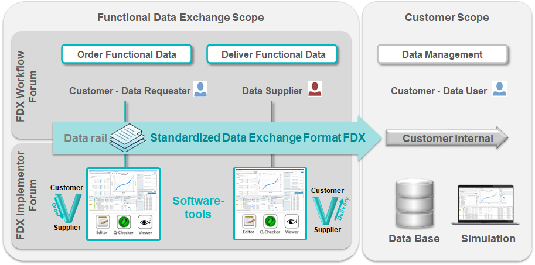

<!--  -->

# prostep ivip Project - Functional Data Exchange (FDX)
## Artefacts
Dear user,

If you want to comment a document in our repository, please create an issue with a reference to the relevant document to leave your comment.
Thanks in advance for helping improving the quality of our FDX documents.

The list of published FDX artefacts:

- [FDX recommendation part 1](https://www.prostep.org/fileadmin/downloads/PSI_VDA_Recom_FDX_Version_1.1.pdf)
- [FDX recommendation parts 2, 3.1 and 3.2](https://www.prostep.org/fileadmin/downloads/FDX-v2.0_1.zip)
- [FDX test data (FDX zip containers)](https://github.com/prostep-ivip-e-V/FDX/tree/main/Test%20Data)
- [Source of the FDX Attribute Converter](https://github.com/prostep-ivip-e-V/FDX/tree/main/Attribute-Converter)
- [FDX White Paper] (https://www.prostep.org/en/medialibrary/publications/?no_cache=1)

Your Prostep ivip FDX Workflow Forum Group

## Project Scope

